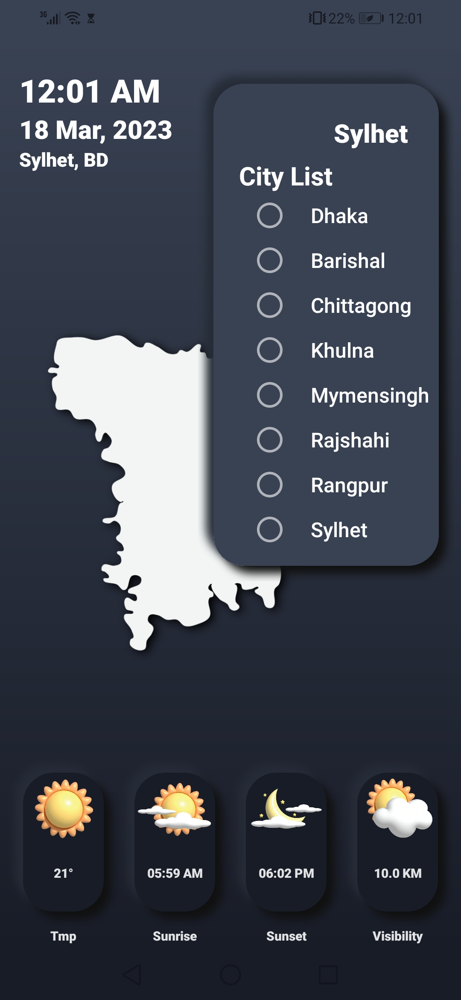
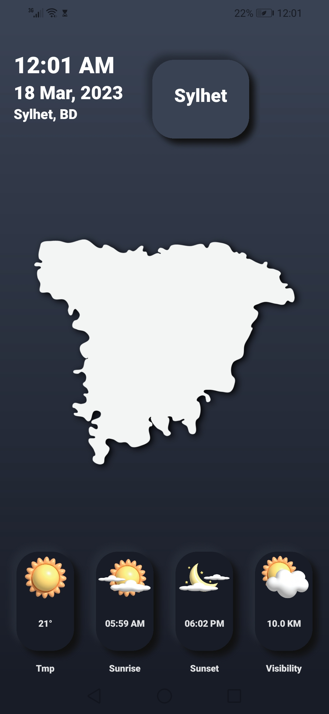
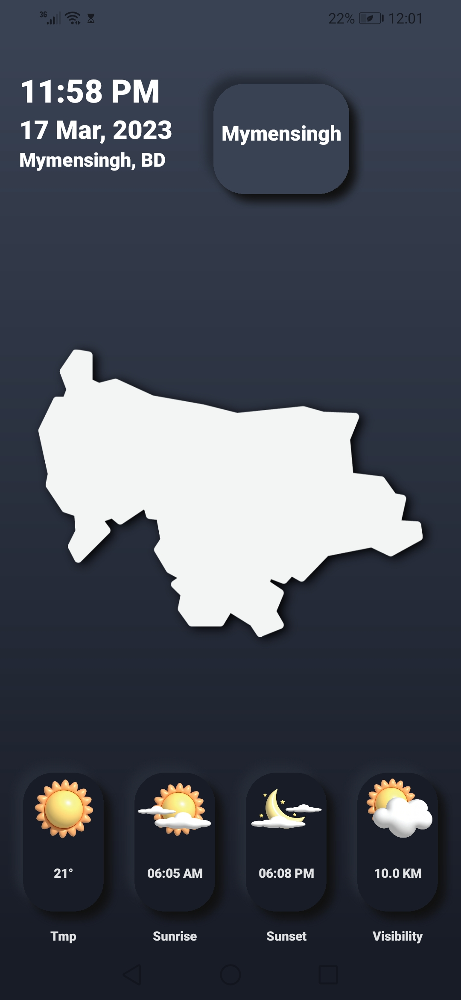
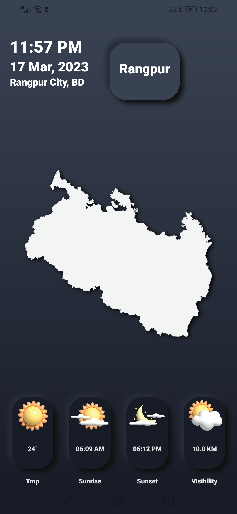
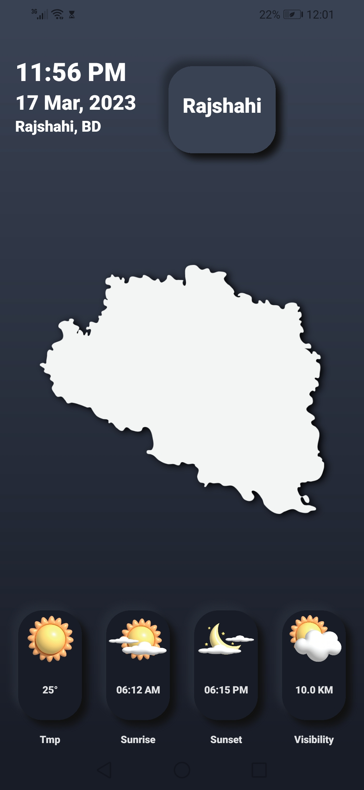
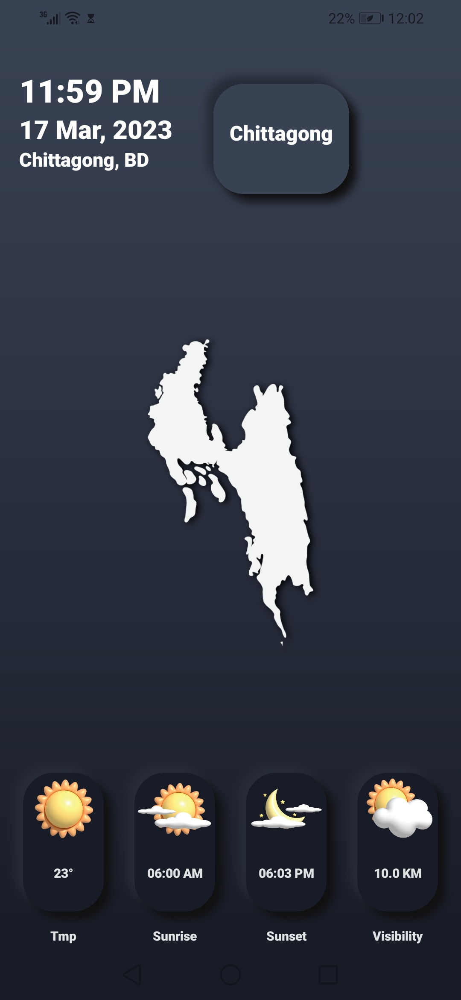
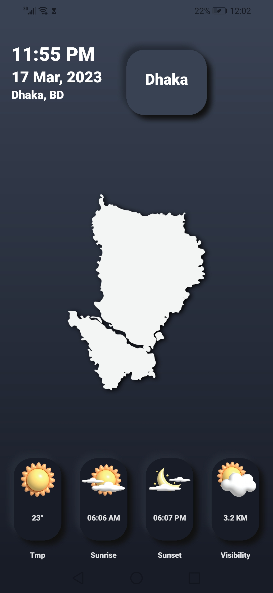
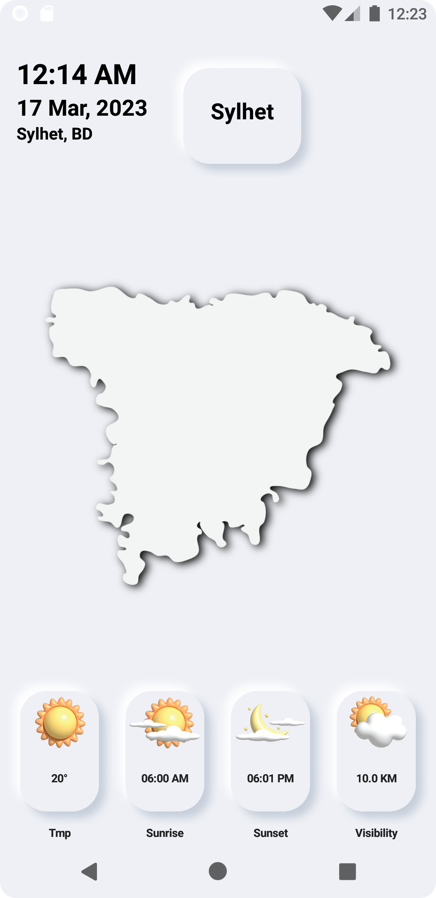
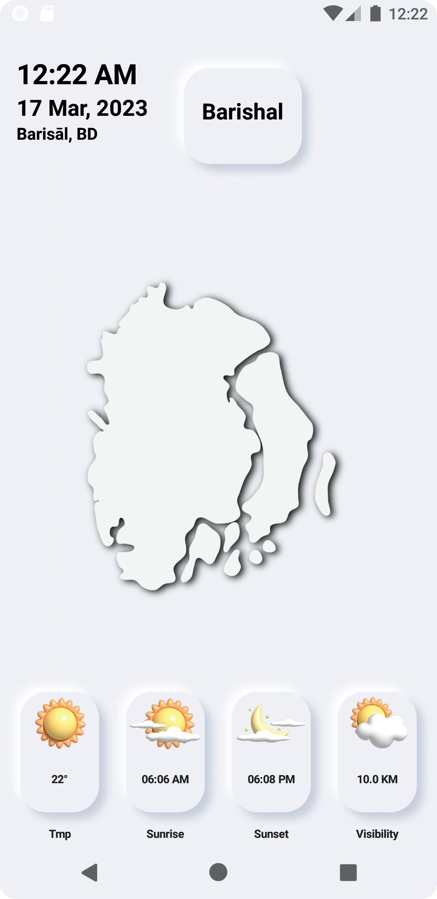
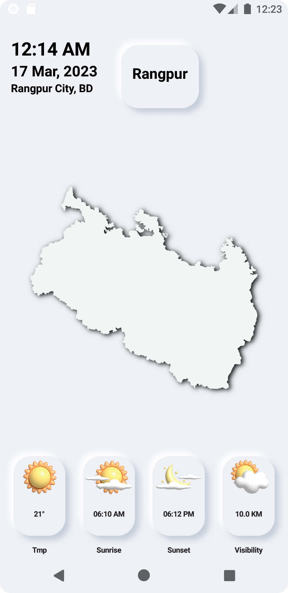

<table style="width:100%">
  <tr>
    <td>

## NeuWeather

Android app built with Jetpack Compose and MVVM, implemented Neumorphic UI.

    
    
    
    

### The purpose of this repository

- Build a fully functional Android app built entirely with Kotlin and Jetpack Compose.
- Follows Android design and development best practices with Compose and MVVM.
- Explore the possibilities of creating complex UI and UX of a popular design trends like Neumorphic UI design using
  Compose.

### Status: 👨‍💻 In progress

NeuWeather is under active development.

</td> 
<td>

  
</td>
</tr>
</table>

### Stack

| Tools & Libraries| Link |
|     :---      |          :---: |
| 🤖 Kotlin | [Kotlin](https://kotlinlang.org) |](https://developer.android.com/jetpack/compose) |
|  Jetpack Compose | [Jetpack Compose](https://developer.android.com/jetpack) |
|  Compose State Hoisting | [State Hoisting](https://developer.android.com/jetpack/compose/state) |
|  Compose Animation | [Compose Animation](https://developer.android.com/jetpack/compose/animation) |
| 🌐 Material Design | [Material Design](https://developer.android.com/jetpack/androidx/releases/compose-material) |
|  Fornewid-Neumorphism | [Neumorphism](https://github.com/fornewid/neumorphism) |
| Accompanist | [UI Controller](https://github.com/google/accompanist/tree/main/systemuicontroller) |
| 🌊 Coroutines | [Coroutines](https://developer.android.com/kotlin/coroutines) |
|  Retrofit | [Retrofit](https://square.github.io/retrofit/) |
| ViewModel | [ViewModel](https://developer.android.com/topic/libraries/architecture/viewmodel) |
|   LiveData | [LiveData](https://developer.android.com/topic/libraries/architecture/livedata) |
| Glide | [Glide](https://github.com/bumptech/glide) |
| Gson | [GSon](https://github.com/google/gson) |

## 📷 Screenshots (Dark theme)

<table style="width:100%">
  <tr>
    <th>Spinner (City List)</th>
    <th>Weather & Map</th> 
    <th>Weather & Map</th>
    <th>Weather & Map</th>
  </tr>
  <tr>
    <td></td> 
    <td></td>
    <td></td> 
    <td></td>
  </tr>
  <tr>
    <th></th>
    <th></th>
    <th></th>
    <th></th>
  </tr>
  <tr>
    <td></td>
    <td></td>
    <td></td>
    <td></td>
  </tr>
</table>

## 📷 Screenshots (Light theme)

<table style="width:100%">
  <tr>
    <th>Spinner (City List)</th>
    <th>Weather & Map</th> 
    <th>Weather & Map</th>
    <th>Weather & Map</th>
  </tr>
  <tr>
    <td></td> 
    <td></td>
    <td></td> 
    <td></td>
  </tr>
  <!-- <tr>
    <th>Invite</th>
    <th>Password Manager Dialog</th>
    <th>Create Server</th>
    <th>Friends</th>
  </tr> -->
  <!-- <tr>
    <td></td>
    <td></td>
    <td></td>
    <td></td>
  </tr> -->
</table>

# Package Structure

    NeuWeather-MVVM Project Structure
    .
    └── neuweather_mvvm
        ├── common
        │   └── RequestCompleteListener.kt
        ├── experiment_views
        │   ├── Lottie.kt
        │   └── NeuUi.kt
        ├── features
        │   └── weather_info_show
        │       ├── model
        │       │   ├── data_class
        │       │   │   ├── City.kt
        │       │   │   ├── Clouds.kt
        │       │   │   ├── Coord.kt
        │       │   │   ├── Main.kt
        │       │   │   ├── NeuMapImages.kt
        │       │   │   ├── Sys.kt
        │       │   │   ├── WeatherButtonLabel.kt
        │       │   │   ├── WeatherDataModel.kt
        │       │   │   ├── WeatherInfoResponse.kt
        │       │   │   ├── Weather.kt
        │       │   │   └── Wind.kt
        │       │   ├── WeatherInfoShowModelImpl.kt
        │       │   └── WeatherInfoShowModel.kt
        │       ├── view
        │       │   ├── MainActivity.kt
        │       │   ├── MainView.kt
        │       │   ├── NeumorphicCard.kt
        │       │   ├── NeuMorphicCell.kt
        │       │   └── NeumorphicSpinner.kt
        │       └── viewmodel
        │           └── WeatherInfoViewModel.kt
        ├── network
        │   ├── ApiInterface.kt
        │   ├── QueryParameterAddInterceptor.kt
        │   └── RetrofitClient.kt
        ├── theme
        │   ├── Shape.kt
        │   ├── ThemeCompose.kt
        │   ├── ThemeManagerImpl.kt
        │   ├── ThemeManager.kt
        │   ├── ThemeModule.kt
        │   └── Type.kt
        └── utils
            └── Extensions.kt

[<a href="#top">Back to top</a>]

